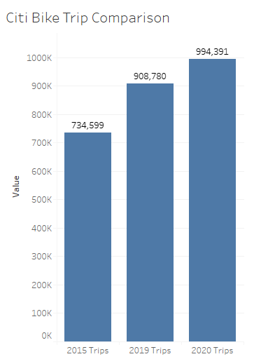
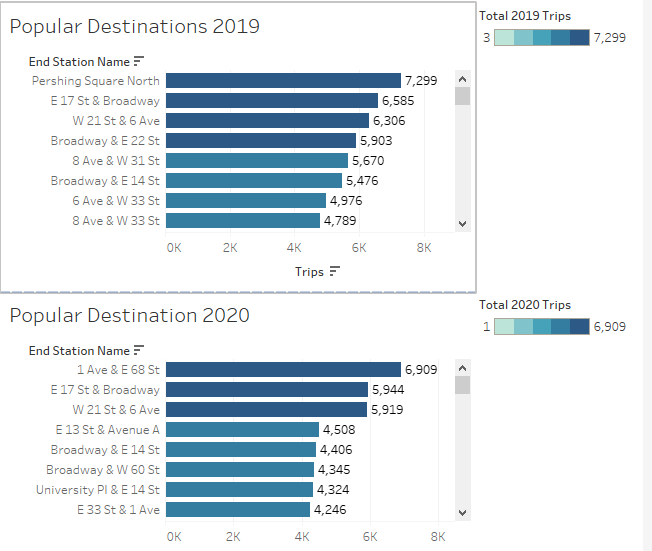
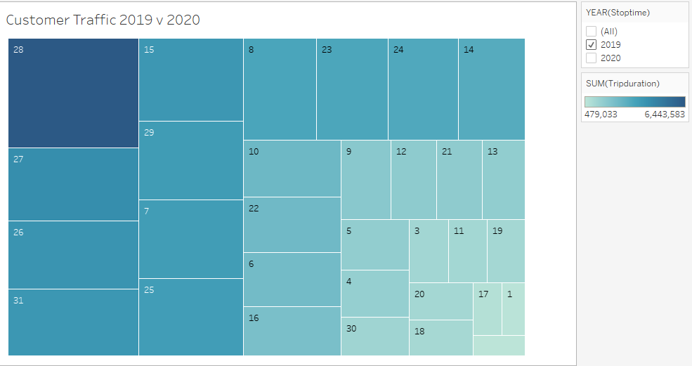
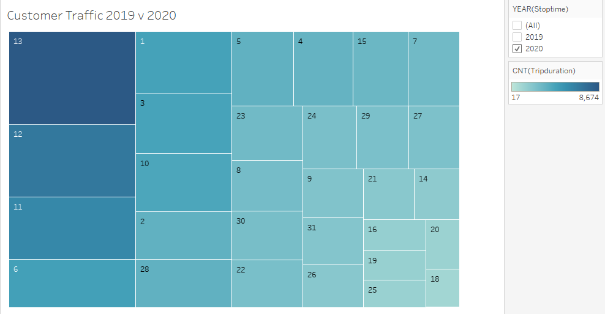

# Citi-bike-analysis

Analysis of citi bike travel.

This repository is a guide to gathering and cleaning the data used for the tableau visualizations.

To run the code. The user will use the citibike-cleaning jupyter notebook and the combining jupyter notebook.

The visualization is a simple representation of citibike trips in New York City during the month of December in 2020 and 2019. 2015 is used to show growth in the use of the citibike service and as a benchmark of precovid times. There is a significant differences between the three years. The first is the use of subscription versus customer use. In 2015 the only data available is for subscribers.

Another notable attribute is the ratio between customers and subscribers. The visualizations are skewed and based on the subscribers of New York City. Below are some of the findings from the data.

The first visualization to look at is the amount of bike trips.

Over the years there has been more bike trips. Notably the increase of bike trips between 2019 and 2020. The data only looks at December. However, even during the pandemic the numbers are still increasing.

With this in mind, we look at where people are going.

An intersting shift is the top destinations in 2019 versus the top destination in 2020. In 2019 the top destination is Pershing Square North. In 2020 the destination is 1 Ave & East 68 Street. Both of these stations are Grand Central Terminal and Cornweil hospital respectively.

With the visualization above, the 28th had the highest amount of bike traffic in 2019 for customers. This shifted greatly for 2020 as seen below. The highest amount of bike traffic was on the 13th.

To view the full tableau public site use [this](https://public.tableau.com/profile/kevin.lam2321#!/vizhome/TheMostWonderfulTimeoftheyear/TimeoftheYear?publish=yes).